# Pokémon Codex Database Overview

> Auto-generated summary of the SQLite schema.

## Table of Contents

- [Pokemon](tables/Pokemon.md)
- [Pokemon_Ability](tables/Pokemon_Ability.md)
- [Pokemon_Evolution](tables/Pokemon_Evolution.md)
- [Pokemon_Game](tables/Pokemon_Game.md)
- [Pokemon_Level_Up_Moveset](tables/Pokemon_Level_Up_Moveset.md)
- [Pokemon_Location](tables/Pokemon_Location.md)
- [Pokemon_Mainline_Game](tables/Pokemon_Mainline_Game.md)
- [Pokemon_Move](tables/Pokemon_Move.md)
- [Pokemon_Move_Category](tables/Pokemon_Move_Category.md)
- [Pokemon_Region](tables/Pokemon_Region.md)
- [Pokemon_Regional_Form](tables/Pokemon_Regional_Form.md)
- [Pokemon_Technical_Move](tables/Pokemon_Technical_Move.md)
- [Pokemon_Technical_Moveset](tables/Pokemon_Technical_Moveset.md)
- [Pokemon_Type](tables/Pokemon_Type.md)
- [Pokemon_Type_Effectiveness](tables/Pokemon_Type_Effectiveness.md)

## Tables Summary

| Table | Rows | Columns | Foreign Keys | Indexes |
|-------|-----:|--------:|-------------:|--------:|
| [Pokemon](tables/Pokemon.md) | 1080 | 11 | 6 | 2 |
| [Pokemon_Ability](tables/Pokemon_Ability.md) | 306 | 3 | 0 | 2 |
| [Pokemon_Evolution](tables/Pokemon_Evolution.md) | 513 | 6 | 4 | 3 |
| [Pokemon_Game](tables/Pokemon_Game.md) | 5 | 2 | 0 | 2 |
| [Pokemon_Level_Up_Moveset](tables/Pokemon_Level_Up_Moveset.md) | 23724 | 6 | 4 | 0 |
| [Pokemon_Location](tables/Pokemon_Location.md) | 5400 | 4 | 3 | 1 |
| [Pokemon_Mainline_Game](tables/Pokemon_Mainline_Game.md) | 3 | 2 | 0 | 2 |
| [Pokemon_Move](tables/Pokemon_Move.md) | 840 | 8 | 2 | 2 |
| [Pokemon_Move_Category](tables/Pokemon_Move_Category.md) | 3 | 2 | 0 | 2 |
| [Pokemon_Region](tables/Pokemon_Region.md) | 10 | 5 | 0 | 1 |
| [Pokemon_Regional_Form](tables/Pokemon_Regional_Form.md) | 4 | 2 | 0 | 2 |
| [Pokemon_Technical_Move](tables/Pokemon_Technical_Move.md) | 429 | 5 | 2 | 0 |
| [Pokemon_Technical_Moveset](tables/Pokemon_Technical_Moveset.md) | 62488 | 5 | 3 | 0 |
| [Pokemon_Type](tables/Pokemon_Type.md) | 18 | 2 | 0 | 2 |
| [Pokemon_Type_Effectiveness](tables/Pokemon_Type_Effectiveness.md) | 324 | 4 | 2 | 0 |

## Incoming References (who depends on whom)

**Pokemon** is referenced by:
- `Pokemon_Evolution.base_pokedex_number` → `Pokemon.pokedex_number`
- `Pokemon_Evolution.base_region_id` → `Pokemon.region_id`
- `Pokemon_Evolution.evolved_pokedex_number` → `Pokemon.pokedex_number`
- `Pokemon_Evolution.evolved_region_id` → `Pokemon.region_id`
- `Pokemon_Level_Up_Moveset.pokedex_number` → `Pokemon.pokedex_number`
- `Pokemon_Level_Up_Moveset.region_id` → `Pokemon.region_id`
- `Pokemon_Location.pokedex_number` → `Pokemon.pokedex_number`
- `Pokemon_Location.region_id` → `Pokemon.region_id`
- `Pokemon_Technical_Moveset.pokedex_number` → `Pokemon.pokedex_number`
- `Pokemon_Technical_Moveset.region_id` → `Pokemon.region_id`

**Pokemon_Ability** is referenced by:
- `Pokemon.hidden_ability_id` → `Pokemon_Ability.ability_id`
- `Pokemon.primary_ability_id` → `Pokemon_Ability.ability_id`
- `Pokemon.secondary_ability_id` → `Pokemon_Ability.ability_id`

**Pokemon_Game** is referenced by:
- `Pokemon_Location.game_id` → `Pokemon_Game.game_id`

**Pokemon_Mainline_Game** is referenced by:
- `Pokemon_Level_Up_Moveset.mainline_game_id` → `Pokemon_Mainline_Game.mainline_game_id`
- `Pokemon_Technical_Move.mainline_game_id` → `Pokemon_Mainline_Game.mainline_game_id`
- `Pokemon_Technical_Moveset.mainline_game_id` → `Pokemon_Mainline_Game.mainline_game_id`

**Pokemon_Move** is referenced by:
- `Pokemon_Level_Up_Moveset.move_id` → `Pokemon_Move.move_id`
- `Pokemon_Technical_Move.move_id` → `Pokemon_Move.move_id`

**Pokemon_Move_Category** is referenced by:
- `Pokemon_Move.category_id` → `Pokemon_Move_Category.category_id`

**Pokemon_Regional_Form** is referenced by:
- `Pokemon.region_id` → `Pokemon_Regional_Form.region_id`

**Pokemon_Type** is referenced by:
- `Pokemon.primary_type_id` → `Pokemon_Type.type_id`
- `Pokemon.secondary_type_id` → `Pokemon_Type.type_id`
- `Pokemon_Move.type_id` → `Pokemon_Type.type_id`
- `Pokemon_Type_Effectiveness.attacking_type_id` → `Pokemon_Type.type_id`
- `Pokemon_Type_Effectiveness.defending_type_id` → `Pokemon_Type.type_id`

## ER Diagram (Mermaid)
The following Mermaid diagram should render on GitHub and many Markdown viewers:

```mermaid
erDiagram
  Pokemon {
    int pokedex_number PK
    int region_id PK
    string name
    string image
    string species
    int primary_type_id
    int secondary_type_id
    int primary_ability_id
    int secondary_ability_id
    int hidden_ability_id
    string description
  }
  Pokemon_Ability {
    int ability_id PK
    string name
    string description
  }
  Pokemon_Evolution {
    int base_pokedex_number PK
    int evolved_pokedex_number PK
    int base_region_id PK
    int evolved_region_id PK
    string evolution_condition
    int chain_id PK
  }
  Pokemon_Game {
    int game_id PK
    string game_name
  }
  Pokemon_Level_Up_Moveset {
    int level_up_moveset_id PK
    int pokedex_number
    int region_id
    int move_id
    int mainline_game_id
    int level_learned
  }
  Pokemon_Location {
    int pokedex_number PK
    int region_id PK
    int game_id PK
    string location_name
  }
  Pokemon_Mainline_Game {
    int mainline_game_id PK
    string game_name
  }
  Pokemon_Move {
    int move_id PK
    string move_name
    string description
    int type_id
    int category_id
    int power
    float accuracy
    int pp
  }
  Pokemon_Move_Category {
    int category_id PK
    string category_name
  }
  Pokemon_Region {
    int region_id PK
    string name
    string image
    int start
    int end
  }
  Pokemon_Regional_Form {
    int region_id PK
    string region_name
  }
  Pokemon_Technical_Move {
    int technical_move_id PK
    int move_id
    int mainline_game_id
    int technical_number
    int is_tr
  }
  Pokemon_Technical_Moveset {
    int technical_moveset_id PK
    int pokedex_number
    int region_id
    int mainline_game_id
    int technical_move_id
  }
  Pokemon_Type {
    int type_id PK
    string type_name
  }
  Pokemon_Type_Effectiveness {
    int type_effectiveness_id PK
    int attacking_type_id
    int defending_type_id
    float damage_multiplier
  }
  Pokemon_Regional_Form ||--o{ Pokemon : "region_id->region_id"
  Pokemon_Ability ||--o{ Pokemon : "hidden_ability_id->ability_id"
  Pokemon_Ability ||--o{ Pokemon : "secondary_ability_id->ability_id"
  Pokemon_Ability ||--o{ Pokemon : "primary_ability_id->ability_id"
  Pokemon_Type ||--o{ Pokemon : "secondary_type_id->type_id"
  Pokemon_Type ||--o{ Pokemon : "primary_type_id->type_id"
  Pokemon ||--o{ Pokemon_Evolution : "evolved_pokedex_number->pokedex_number"
  Pokemon ||--o{ Pokemon_Evolution : "evolved_region_id->region_id"
  Pokemon ||--o{ Pokemon_Evolution : "base_pokedex_number->pokedex_number"
  Pokemon ||--o{ Pokemon_Evolution : "base_region_id->region_id"
  Pokemon_Mainline_Game ||--o{ Pokemon_Level_Up_Moveset : "mainline_game_id->mainline_game_id"
  Pokemon_Move ||--o{ Pokemon_Level_Up_Moveset : "move_id->move_id"
  Pokemon ||--o{ Pokemon_Level_Up_Moveset : "pokedex_number->pokedex_number"
  Pokemon ||--o{ Pokemon_Level_Up_Moveset : "region_id->region_id"
  Pokemon_Game ||--o{ Pokemon_Location : "game_id->game_id"
  Pokemon ||--o{ Pokemon_Location : "pokedex_number->pokedex_number"
  Pokemon ||--o{ Pokemon_Location : "region_id->region_id"
  Pokemon_Move_Category ||--o{ Pokemon_Move : "category_id->category_id"
  Pokemon_Type ||--o{ Pokemon_Move : "type_id->type_id"
  Pokemon_Mainline_Game ||--o{ Pokemon_Technical_Move : "mainline_game_id->mainline_game_id"
  Pokemon_Move ||--o{ Pokemon_Technical_Move : "move_id->move_id"
  Pokemon_Mainline_Game ||--o{ Pokemon_Technical_Moveset : "mainline_game_id->mainline_game_id"
  Pokemon ||--o{ Pokemon_Technical_Moveset : "pokedex_number->pokedex_number"
  Pokemon ||--o{ Pokemon_Technical_Moveset : "region_id->region_id"
  Pokemon_Type ||--o{ Pokemon_Type_Effectiveness : "defending_type_id->type_id"
  Pokemon_Type ||--o{ Pokemon_Type_Effectiveness : "attacking_type_id->type_id"
```

You can also open the full diagram source at `er\pokedex.mmd`.
